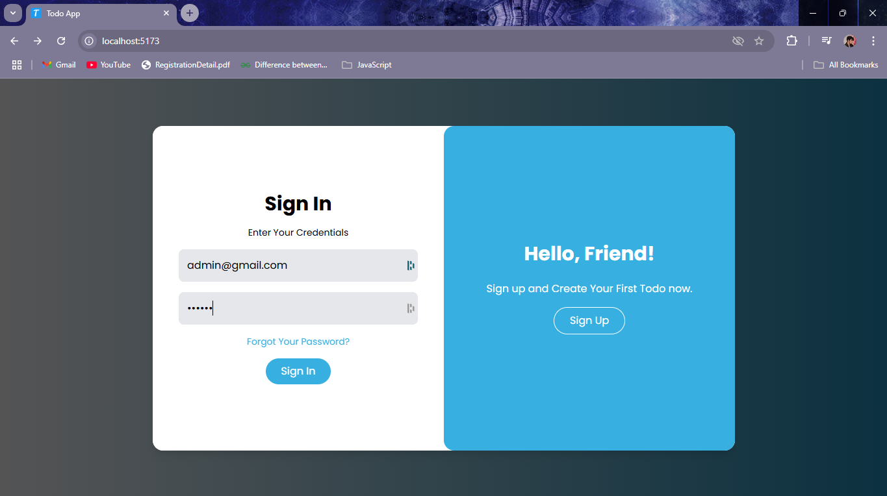
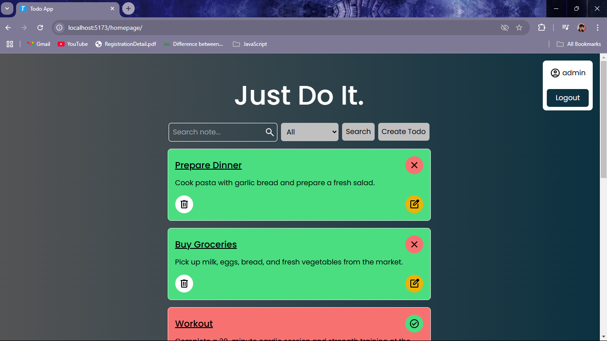
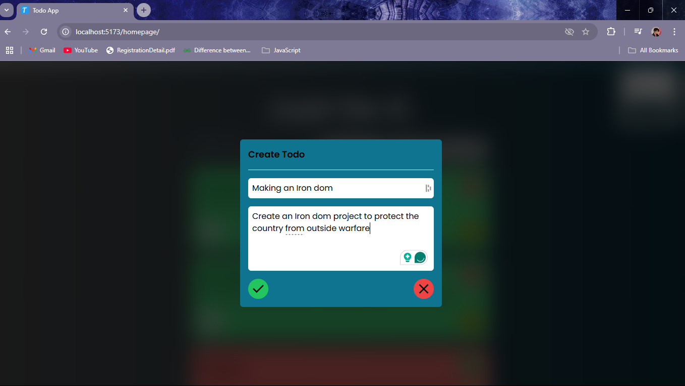
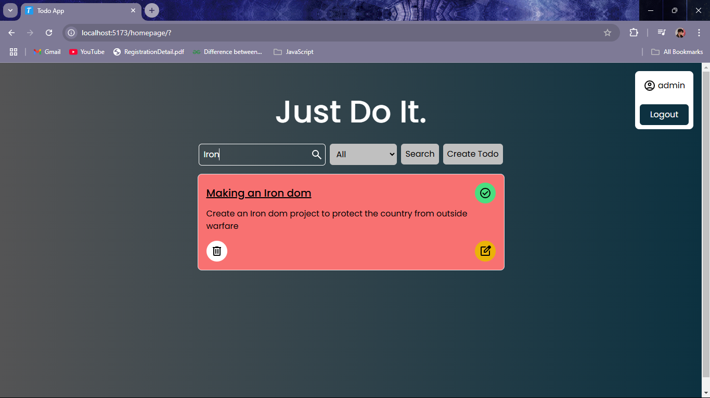
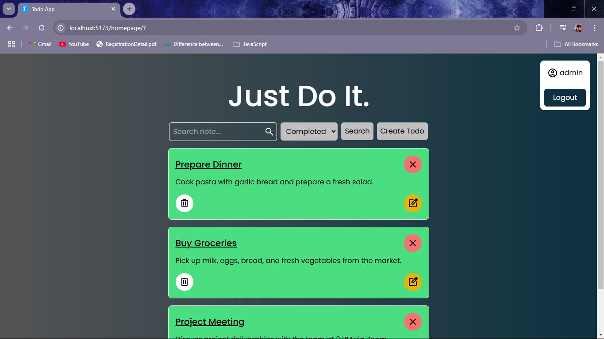
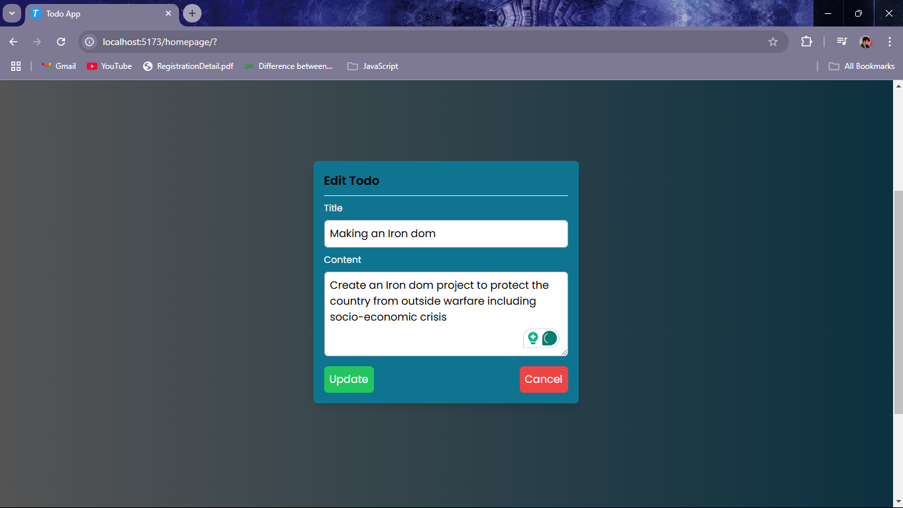

# Just Do It.
[Just Do It!]() is your go-to task manager, built for simplicity and efficiency. Log in to access your personalized to-dos, filter tasks by status, and search with ease. With local storage support, your tasks are always accessible, even offline. Designed for desktop responsiveness, it ensures a seamless experience while keeping your tasks secure and user-specific. Stay organized and productive with Just Do It!

- View the local installation in the [CONTRUBUTING.md](https://github.com/darkkphoenyx/Just_Do-It-TodoApp/blob/master/CONTRIBUTING.md).

### _Features_:

- User-friendly
- Local Storage Supported
- Todo Filtering (Completed / Remaining)
- Displays username
- Search Todo with title strings
- Responsive for Desktop
- Authorized Users (Todos are user-based protected)

### _Discuss issues here_:

Check [Issues](https://github.com/darkkphoenyx/Just_Do-It-TodoApp/issues) for contributing to this repository.

# _References_

- For Fonts: [Google Fonts](https://fonts.google.com/)
- For Local Storage: [Web Dev Simplified Blog](https://blog.webdevsimplified.com/2020-08/cookies-localStorage-sessionStorage/)

# _Contributions_

- All contributors are most welcome! This is definitely open source!
- View the [`CONTRIBUTING.md`](https://github.com/darkkphoenyx/Just_Do-It-TodoApp/blob/master/CONTRIBUTING.md) for further instructions, requirements/dependencies & local project setup instructions!
- All the contributors to this repository can be found in the [`CONTRIBUTORS.md`](https://github.com/darkkphoenyx/task1_Todo_final/blob/master/CONTRIBUTORS.md) file!

## _WEBSITE DEMO_

a) Logging In

b) Displaying all the Todos

c) Creating a Todo

d) Searching a Todo with some of its title string

e) Filtering Completed Todo only

f) Updating a Todo

# _Author_

- Deepesh Sunuwar (@darkkphoenyx)
  - [LinkedIn](https://www.linkedin.com/in/deepeshsunuwar/)
